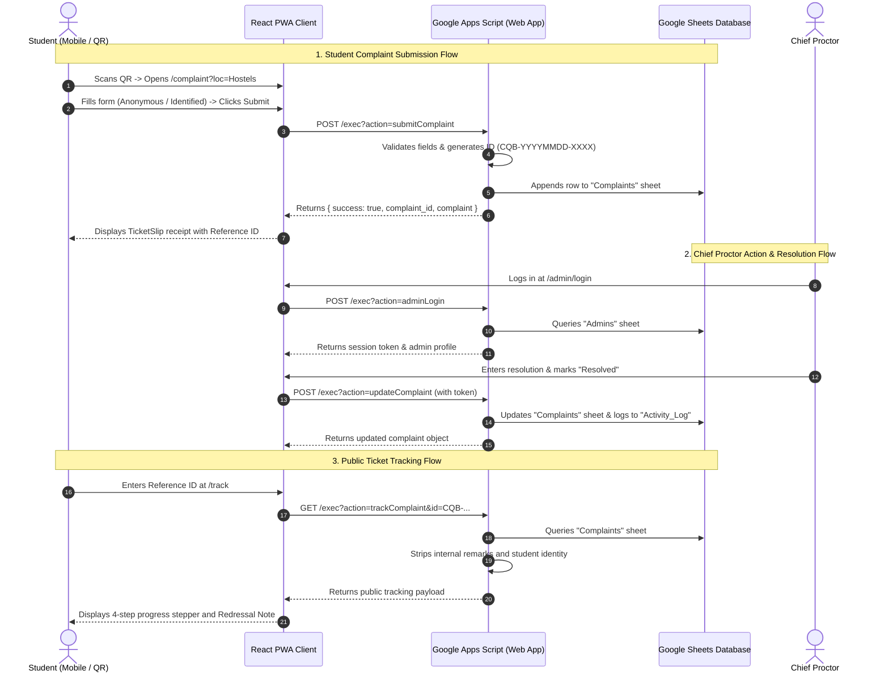

# 🏛️ System Architecture — College QR Complaint Box v2.1.0

This document outlines the end-to-end architecture, design system specifications, data flows, and security model of the **College QR Complaint Box System** (v2.1.0).

---

## 1. High-Level Architecture

The system operates as a lightweight, scalable, and zero-server-maintenance 3-tier architecture:

```
┌──────────────────────────────────────────────────────────────────┐
│                   React 18 + TypeScript Client                   │
│   (Vite 5 • Tailwind CSS 3 • Lucide React • React Router v6)     │
└────────────────────────────────┬─────────────────────────────────┘
                                 │
                     HTTPS JSON / REST API (CORS)
                                 │
                                 ▼
┌──────────────────────────────────────────────────────────────────┐
│            Google Apps Script Serverless Web App API             │
│        (V8 JavaScript Runtime • doGet / doPost Dispatcher)        │
└────────────────────────────────┬─────────────────────────────────┘
                                 │
                    SpreadsheetApp Service (CRUD)
                                 │
                                 ▼
┌──────────────────────────────────────────────────────────────────┐
│                    Google Sheets Database                        │
│   • Complaints   • Admins   • Categories   • Locations   • Logs  │
└──────────────────────────────────────────────────────────────────┘
```

---

## 2. Design System & 3-Level Surface Elevation Scale

The visual architecture implements an institutional 3-level elevation hierarchy:

| Surface Level | CSS Variable | Color Code | Role & Usage |
| :--- | :--- | :--- | :--- |
| **Surface 0 (Canvas)** | `--color-surface-0` / `--color-paper` | `#EAEDF3` | Page and main-content viewport background providing distinct visual separation. |
| **Surface 1 (Cards)** | `--color-surface-1` / `--color-paper-card` | `#FFFFFF` | Form containers, data tables, modal dialogs, and navigation headers (`border border-hairline` `#D7DEE8` + `shadow-sm`). |
| **Surface 2 (Recessed)** | `--color-surface-2` / `--color-paper-recessed` | `#F3F5F9` | Resting input fields, select dropdowns, table row stripes, and quick-response chip trays. |
| **Ink-Navy Institutional** | `--color-ink-navy` / `--color-ink-navy-card` | `#101B36` / `#16234A` | Sidebar navigation, TicketStub header cards, developer credit bars, and printable borders. |

### Typography Scale
- **Display Serif**: `Fraunces` (Georgia / Serif fallback) for main page titles (`h1`), modal headers, and KPI numerals.
- **Body & UI**: `Inter` (sans-serif) for labels, descriptions, and data tables.
- **Reference & Metadata**: `JetBrains Mono` / `Courier` for Reference IDs (`CQB-YYYYMMDD-XXXX`), timestamps, and status badges.

---

## 3. Component Architecture

### 3.1 Public Student Portal
- **Landing Page (`/`)**: Hero section with institutional badge, trust strip, feature grid, and live interactive QR placard.
- **Grievance Filing (`/complaint`)**:
  - Auto-detection of category and location parameters from QR code URLs (`?loc=Hostels&cat=Cleanliness`).
  - Strict client-side validation engine.
  - Zero-log 100% anonymous submission mode.
- **Ticket Slip (`/complaint/success`)**: Printable confirmation receipt with reference code and confetti celebration.
- **Public Tracker (`/track`)**:
  - Live 4-step status stepper (`Logged` ➔ `Under Review` ➔ `In Progress` ➔ `Resolved`).
  - Proctor redressal remarks with private administrative notes stripped out.

### 3.2 Chief Proctor Management ERP
- **Persistent Shell**: Collapsible dark navy sidebar (`AdminSidebar`), institutional header (`AdminHeader`) with live date/time and unread badge.
- **Dashboard (`/admin/dashboard`)**: 5 KPI stat cards with inflow counter and recent complaint feed.
- **Complaints Repository (`/admin/complaints`)**:
  - Dynamic dual view: responsive data table (desktop) and compact cards (mobile).
  - Multi-parameter filtering with instant text search.
- **Complaint Details Hub (`/admin/complaints/:id`)**:
  - Signature TicketStub header with copy ID button.
  - Status management dropdown with 1-click quick response presets.
  - Proctor notes and resolution text editor.
  - Isolated Danger Zone with confirmation modal for permanent ticket deletion.
- **Categories Directory (`/admin/categories`)**: Drag-reorderable category list with status toggles, department liaisons, and icon picker.
- **Locations Directory (`/admin/locations`)**: Campus buildings/areas with direct location-specific poster generation.
- **Activity Log (`/admin/activity-log`)**: Fact-based audit timeline tracking all administrative events.
- **QR Studio & Settings (`/admin/settings`)**: Direct-print A4/A5/Letter poster generation, college profile editor, and passkey manager.

---

## 4. End-to-End Sequence Diagram



---

## 5. Security & Anonymity Model

1. **Zero Personal Data Stored for Anonymous Reports**: When the `is_anonymous` flag is active, student name, roll number, and contact info are stripped prior to storage.
2. **Access Control**: Administrative endpoints require valid token validation against the `Admins` sheet.
3. **Public Data Sanitization**: The `trackComplaint` endpoint only returns public fields (`complaint_id`, `category`, `location`, `title`, `description`, `status`, `resolution`, `submitted_at`).
4. **Audit Immutability**: Every status update, note addition, and complaint deletion records a timestamped audit entry in `Activity_Log`.
